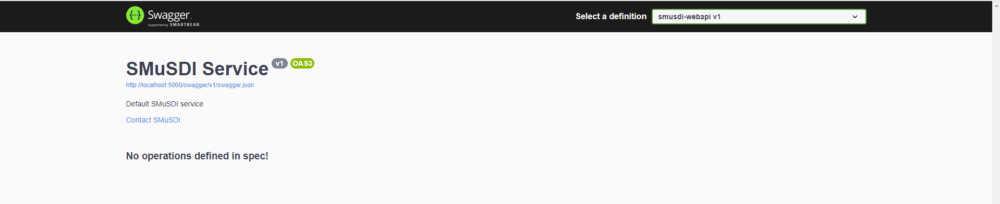

# Welcome to Smusdi

The *Smusdi* project provides a set of **.NET** libraries used to help developing and testing C# services by avoiding boilerplate code.

## Creating a WEB API with **Smusdi**

- Create project:
    ```sh
    mkdir smusdi-webapi
    cd smusdi-webapi/
    dotnet new console --name smusdi-webapi
    dotnet add smusdi-webapi/smusdi-webapi.csproj package Smusdi.Core 
    ```

- Update *Program.cs*:
    ```cs
    using Smusdi.Core;

    SmusdiService.InitAndRun(args);
    ```

- Run project:
    ```
    dotnet run --project smusdi-webapi/smusdi-webapi.csproj
    ```

- Open [swagger ui](http://localhost:5000/swagger/index.html) to check that it works:


